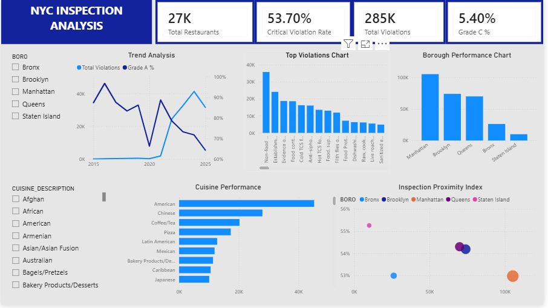

# Food Safety Inspection Analysis

## Overview

This project analyzes restaurant inspection data to identify common food safety violations, high-risk areas, and opportunities for improving public health outcomes.

## Tools Used

- Excel
- SQL
- Power BI

## Business Questions

1. Which violations are more common and where do they mostly occur?
2. Which cuisine and neighborhood has the lowest food safety performance?
3. How do restaurant grades and violations vary across boroughs and over time?
4. Where should the city focus inspections, policies, or education efforts?

## Project Structure

- Data
  - Raw Data
  - Cleaned Data
- SQL Scripts
- Power BI Dashboard
- Dashboard Images
- Documentation

## Dashboard Preview

## Key Skills Demonstrated

- Data Cleaning
- SQL Querying
- Exploratory Data Analysis

## Linked data
Due to the size of the dataset, i only uploaded the first 1000 rows, for both the raw and cleaned data, respectively.
You can access the whole dataset via the link below;
https://drive.google.com/drive/folders/1zwTYgH6bUY03Wh06HYBhvxaqNj5bhkWs

## SQL Analysis
Key analyses performed;

- Most common violations
- Borough perfomance comparison
- Cuisine risk analysis
- Grade trend analysis
- Critical violation rate calculations
- Data Visualization
- Business Intelligence
